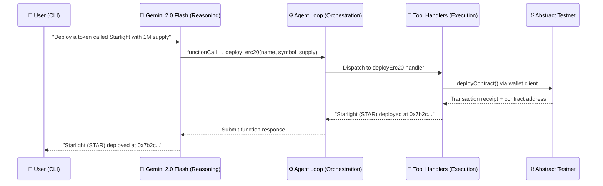

<div align="center">

# Dimensity

**Autonomous AI Agent for On-Chain Execution**

A CLI-first developer tool that translates natural language into real blockchain transactions on [Abstract Testnet](https://abs.xyz/) — powered by Gemini function calling and viem.

[](https://nodejs.org/)
[](https://www.typescriptlang.org/)
[](https://ai.google.dev/)
[](https://viem.sh/)
[](https://opensource.org/licenses/MIT)

</div>

---

## 📖 Overview

**Dimensity** is not a chatbot — it is an **autonomous AI agent system** that bridges the gap between natural language and on-chain execution.

Built in TypeScript, it connects Gemini 2.0 Flash to a live blockchain wallet through the [Google Generative AI SDK](https://ai.google.dev/gemini-api/docs) with function calling. When a user types an instruction like *"deploy a token called Starlight"*, the agent reasons about what tools to invoke, executes the corresponding blockchain operation via [viem](https://viem.sh/), and returns the result — all without the user ever constructing a transaction, encoding calldata, or managing nonces.

The agent operates on **Abstract Testnet**, a zkSync-based Layer 2 network, with native EIP-712 transaction signing support.

---

## ⚡ Quick Start

```bash
git clone https://github.com/Hitman350/Openai-onchain-assistant.git
cd Openai-onchain-assistant
npm install
```

Create a `.env` file:

```env
GEMINI_API_KEY=your-gemini-api-key
PRIVATE_KEY=0xyour-abstract-testnet-private-key
```

```bash
npm start
```

```
You: Deploy a token called "Starlight" with symbol "STAR" and 1 million supply
Dimensity: Starlight (STAR) token deployed successfully at: 0x7b2c...
```

---

## 🔥 Motivation

Blockchain interaction today is hostile to most users and even many developers:

- **Transaction assembly is manual and error-prone** — constructing calldata, setting gas limits, managing nonces, and signing with the correct key requires deep protocol knowledge.
- **Smart contract deployment is a multi-step process** — compiling, encoding constructor arguments, and verifying bytecode introduces friction that discourages experimentation.
- **Every chain has its own tooling nuances** — zkSync's EIP-712 signing, L2 fee models, and RPC quirks add another layer of complexity.

Dimensity significantly reduces this friction. Instead of writing code or navigating complex UIs, you describe what you want in plain English. The agent handles reasoning, tool selection, parameter extraction, and execution — turning blockchain interaction into a conversation.

**Natural language is the most accessible interface.** Pairing it with an autonomous agent that can reason *and* execute creates a powerful paradigm for interacting with on-chain systems.

---

## ⚙️ Features

| Capability | Description |
|:-----------|:------------|
| **Autonomous Agent Loop** | Recursive tool-call processing — the agent continues execution until all required actions are resolved, enabling multi-step workflows from a single prompt |
| **ETH Balance Queries** | Read the native ETH balance of any wallet address on Abstract Testnet |
| **ETH Transfers** | Sign and broadcast ETH transfers from the connected wallet to any recipient |
| **ERC-20 Token Deployment** | Deploy custom ERC-20 contracts with configurable name, symbol, and initial supply — directly from natural language |
| **Transaction Explainer** | Decode any tx hash into plain English — status, parties, value, gas cost |
| **Contract Security Scanner** | Bytecode-level scan for mint, pause, blacklist and ownership functions with CRITICAL/HIGH/MEDIUM/LOW risk ratings |
| **Token Info Reader** | Fetch name, symbol, decimals, and total supply from any ERC-20 contract |
| **Gas Estimator** | Estimate transaction cost before broadcasting — shows gas units, Gwei price, and total ETH needed |
| **Wallet Introspection** | Retrieve the connected wallet's address derived from the configured private key |
| **CLI-First Interface** | Terminal-based conversational interface built for developers — no transaction builders, no ABI encoding, no manual signing |
| **Extensible Tool Registry** | Adding a new on-chain capability requires only defining a `ToolConfig` object and registering it — zero changes to the agent loop |

---

## 🤖 Agent Design

Dimensity implements a proper **agent architecture** — the LLM does not execute transactions directly. It *reasons about what to do* and delegates execution to a deterministic tool layer.

### Core Loop

```
User Input → LLM Reasoning → Tool Call(s) → On-Chain Execution → Result → LLM Response
                  ↑                                                    |
                  └────────────── Recursive Loop ──────────────────────┘
```

### How It Works

1. **Model Initialization** — On startup, a Gemini 2.0 Flash model is configured with function declarations converted from the tool registry. The model knows *what tools exist* and *how to invoke them* via Gemini function calling schemas.

2. **Message Handling** — User input is sent to the model via a chat session that maintains conversation history. The model decides whether it needs to call tools or can respond directly.

3. **Tool Call Interception** — When the model response contains function calls, the agent loop (`performRun`) intercepts them and dispatches each to its registered handler in the tool registry.

4. **Concurrent Dispatch** — Multiple tool calls within a single step are dispatched concurrently at the orchestration level via `Promise.all`. Note that on-chain transactions may still depend on nonce ordering and network state at the blockchain level.

5. **Recursive Resolution** — The agent loop continues processing function calls until the model produces a final text response with no further tool invocations. This enables **multi-step execution chains** — a single user message can trigger a sequence of dependent tool calls resolved across multiple iterations.

6. **Response Composition** — Once all tool calls are resolved, the model composes a natural language response incorporating the execution results.

### Separation of Concerns

| Layer | Responsibility | Implementation |
|:------|:---------------|:---------------|
| **Reasoning** | Decide *what* to do, *which* tools to call, *what* arguments to pass | Gemini 2.0 Flash via Google Generative AI SDK |
| **Orchestration** | Manage the agent loop, dispatch tool calls, handle errors | `performRun.ts` (agent loop with concurrent dispatch) |
| **Execution** | Perform blockchain operations via deterministic code paths | Tool handlers using viem clients |
| **Transport** | Sign and broadcast transactions to the network | viem wallet/public clients with EIP-712 |

> The LLM never touches private keys, never constructs raw transactions, and never directly interacts with the network. It produces structured function calls (JSON) that the execution layer interprets via deterministic code paths — though the on-chain outcome depends on network state (gas, nonce, block inclusion).

---

## 🧠 How It Works



---

## 🏗️ Architecture

```
src/
├── index.ts                        # CLI entry point — interactive readline loop
├── gemini/
│   ├── createModel.ts              # Initializes Gemini with function declarations
│   └── performRun.ts               # Recursive agent loop — processes function calls
├── tools/
│   ├── allTools.ts                 # Tool registry — ToolConfig interface + Gemini schema converter
│   ├── getBalance.ts               # Reads native ETH balance via public client
│   ├── getWalletAddress.ts         # Returns wallet address derived from private key
│   ├── sendTransaction.ts          # Signs and sends ETH transfers via wallet client
│   ├── deployErc20.ts              # Deploys ERC-20 contracts via wallet client
│   ├── explainTransaction.ts       # Decodes tx hash into status, value, gas cost breakdown
│   ├── scanContract.ts             # Bytecode-level security scan for dangerous selectors
│   ├── getTokenInfo.ts             # Reads ERC-20 name, symbol, decimals, totalSupply
│   └── estimateGas.ts              # Pre-broadcast gas cost estimation
├── viem/
│   ├── createViemPublicClient.ts   # Read-only JSON-RPC client (Abstract Testnet)
│   └── createViemWalletClient.ts   # Signing client with EIP-712 wallet actions
└── const/
    └── contractDetails.ts          # ERC-20 ABI and compiled bytecode
```

### Key Design Decisions

- **Tool Registry Pattern** — All tools are defined in `allTools.ts` with a unified `ToolConfig` interface containing both the function schema and the execution handler. Schemas are automatically converted to Gemini-compatible `FunctionDeclaration` format at startup. Adding a new on-chain capability is a single-file addition — no modifications to the agent loop required.

- **Recursive Agent Loop** — `performRun.ts` continuously processes function calls until the model produces a final text response, enabling multi-step tool-call chains within a single user message. This is what makes Dimensity an *agent* rather than a single-shot function caller.

- **EIP-712 Native Support** — The wallet client extends viem's `eip712WalletActions()` for native zkSync transaction signing, handling the Abstract Testnet's custom transaction format transparently.

- **Concurrent Tool Dispatch** — `performRun.ts` dispatches all pending tool calls concurrently at the orchestration level via `Promise.all`, reducing latency when the model requests multiple operations in a single step. On-chain ordering is still governed by nonce sequencing at the network level.

---

## 🔐 Security Considerations

Dimensity is designed with a clear **security boundary** between the LLM and the execution layer:

| Principle | Implementation |
|:----------|:---------------|
| **Private key isolation** | The private key is loaded from environment variables and only accessed by the viem wallet client. The LLM never sees, receives, or processes the key. |
| **LLM does not directly execute transactions** | Gemini only *reasons* about what should happen and outputs structured function calls. The actual signing and broadcasting is performed by a **separate execution layer** (viem handlers). The model has no direct access to private keys, RPC endpoints, or signing capabilities. |
| **Deterministic code paths** | Tool handlers follow fixed execution logic for a given set of inputs. The code path from function call to transaction broadcast contains no LLM-influenced branching. However, the on-chain outcome is subject to network conditions (gas prices, nonce state, block inclusion). |
| **Error containment** | Tool execution failures are caught, serialized, and returned to the model as tool outputs. The agent loop continues gracefully without exposing stack traces or internal state. |
| **LLM intent misinterpretation** | As with any LLM-driven system, the model may misinterpret user intent or hallucinate parameters. Dimensity currently executes tool calls without a confirmation step. Future iterations may include a human-in-the-loop approval layer for high-risk operations. |

> [!CAUTION]
> This is a **testnet-only** CLI tool. Running against mainnet without additional safety measures (transaction simulation, spending limits, human-in-the-loop confirmation) is strongly discouraged.

---

## 🚀 Getting Started

### Prerequisites

| Requirement | Details |
|:------------|:--------|
| **Node.js** | Version 18 or higher |
| **npm** | Included with Node.js |
| **Gemini API Key** | Obtain from [ai.google.dev](https://ai.google.dev/gemini-api/docs/api-key) |
| **Private Key** | For an Abstract Testnet wallet funded with testnet ETH |

### Installation

```bash
# Clone the repository
git clone https://github.com/Hitman350/Openai-onchain-assistant.git
cd Openai-onchain-assistant

# Install dependencies
npm install
```

### Configuration

Create a `.env` file in the project root:

```env
GEMINI_API_KEY=your-gemini-api-key
PRIVATE_KEY=0xyour-abstract-testnet-private-key
```

> [!CAUTION]
> Never commit your `.env` file to version control. The `.gitignore` is preconfigured to exclude it. Rotate any keys that may have been exposed.

### Obtaining Testnet ETH

Visit the [Abstract Testnet Faucet](https://faucet.abs.xyz/) to fund your wallet with testnet ETH before sending transactions or deploying contracts.

### Running

```bash
npm start
```

This compiles the TypeScript source and launches the interactive CLI. Type your messages and press **Enter**. Type `exit` to end the session.

---

## 💬 Usage Examples

```
You: What is my wallet address?
Dimensity: Your connected wallet address is 0x1234...abcd

You: What's the balance of 0xabc...def?
Dimensity: 0.450000 ETH

You: Send 0.05 ETH to 0xabc...def
Dimensity: Sent 0.05 ETH to 0xabc...def.
           Tx Hash: 0x9f3a...
           https://explorer.testnet.abs.xyz/tx/0x9f3a...

You: Deploy a token called "Starlight" with symbol "STAR" and 1 million supply
Dimensity: Starlight (STAR) deployed at 0x7b2c...
           Supply: 1,000,000 STAR
           https://explorer.testnet.abs.xyz/address/0x7b2c...

You: What happened in tx 0x9f3a...?
Dimensity: ✅ Success — 0x1234...abcd sent 0.050000 ETH to 0xabc...def.
           Gas cost: 0.000042 ETH | Block: 1234567
           https://explorer.testnet.abs.xyz/tx/0x9f3a...

You: Is this contract safe? 0x7b2c...
Dimensity: Risk: MEDIUM
           ⚠️ owner() — contract has a privileged owner
           ⚠️ mint(address,uint256) — owner can mint unlimited tokens
           Recommendation: 🟡 Moderate risk. Standard caution advised.
           https://explorer.testnet.abs.xyz/address/0x7b2c...

You: Tell me about token 0x7b2c...
Dimensity: Starlight (STAR) — 18 decimals
           Total Supply: 1,000,000 STAR
           https://explorer.testnet.abs.xyz/address/0x7b2c...

You: Estimate gas to send 0.01 ETH to 0xabc...def
Dimensity: Gas estimate: 21,000 units @ 0.2500 Gwei
           Gas cost: 0.00000525 ETH
           Total needed: 0.01000525 ETH
```

> Each of these examples triggers the full agent loop — the model reasons about the intent, selects the appropriate tool, constructs the arguments, and delegates to the execution handler.

---

## 🔗 Network Details

| Property | Value |
|:---------|:------|
| **Chain** | Abstract Testnet |
| **Network Type** | zkSync-based Layer 2 |
| **EIP-712** | Supported via `eip712WalletActions` |
| **Faucet** | [faucet.abs.xyz](https://faucet.abs.xyz/) |
| **Explorer** | [explorer.testnet.abs.xyz](https://explorer.testnet.abs.xyz/) |

---

## 🧰 Tech Stack

| Technology | Role |
|:-----------|:-----|
| [**Google Generative AI SDK**](https://github.com/google-gemini/generative-ai-js) | Gemini 2.0 Flash with function calling — LLM-driven reasoning and tool selection |
| [**viem**](https://viem.sh/) | Type-safe Ethereum client — public client for reads, wallet client for signing with EIP-712 |
| [**TypeScript**](https://www.typescriptlang.org/) | Strict mode, ES2022 target, NodeNext module resolution |
| [**dotenv**](https://github.com/motdotla/dotenv) | Environment variable management for key isolation |

---

## 🤝 Contributing

Contributions are welcome. To add a new on-chain tool:

1. Create a new file in `src/tools/` implementing the `ToolConfig` interface.
2. Define the function schema (`definition`) and the execution handler.
3. Register the tool in `src/tools/allTools.ts`.

```ts
// Example: src/tools/myNewTool.ts
import { ToolConfig } from "./allTools";

export const myNewTool: ToolConfig<{ param: string }> = {
  definition: {
    type: "function",
    function: {
      name: "my_new_tool",
      description: "Description of what this tool does",
      parameters: {
        type: "object",
        properties: {
          param: { type: "string", description: "Parameter description" },
        },
        required: ["param"],
      },
    },
  },
  handler: async ({ param }) => {
    // Execution logic — this handler is dispatched by the agent loop
    return `Result for ${param}`;
  },
};
```

The agent loop will automatically discover and dispatch to your new tool — no modifications to `performRun.ts` required.

---

## 📄 License

This project is licensed under the [MIT License](LICENSE).
